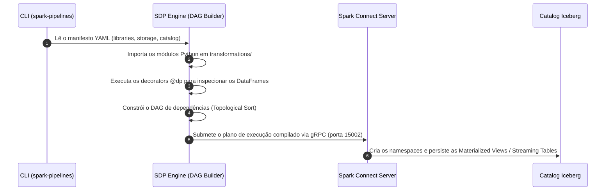
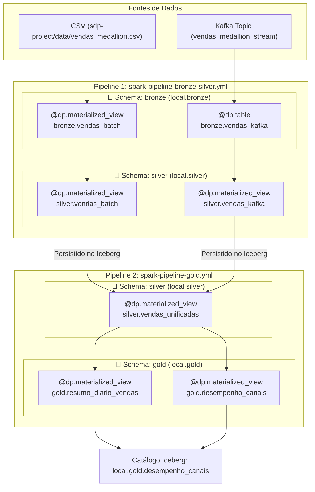

# 🚀 Spark Declarative Pipelines (SDP) - Databricks Lakeflow-Like Local Lakehouse

Este projeto é um **ambiente de estudos didático e prático** desenvolvido para testar e dominar o **Spark Declarative Pipelines (SDP)** localmente, servindo como um espelho open-source para a experiência do **Databricks Lakeflow Pipelines** (antigo *Delta Live Tables - DLT*) sem depender de custos de nuvem ou assinaturas.

A proposta é construir manual e didaticamente toda a infraestrutura de um Data Lakehouse local com **Apache Spark 4.1.3**, **Apache Kafka** e **Apache Iceberg**, aplicando a **Arquitetura Medallion (Bronze, Silver e Gold)** com processamento unificado **Batch + Streaming**.

---

## 📑 Sumário

1. [💡 O que é o Spark Declarative Pipelines (SDP)?](#-o-que-é-o-spark-declarative-pipelines-sdp)
2. [⚔️ Comparativo: Databricks Lakeflow Pipelines vs Apache Spark 4.x SDP](#️-comparativo-databricks-lakeflow-pipelines-vs-apache-spark-4x-sdp)
3. [🧩 Paradigma Declarativo vs. Imperativo](#-paradigma-declarativo-vs-imperativo)
4. [⚙️ Como o SDP Funciona Por Baixo dos Panos](#️-como-o-sdp-funciona-por-baixo-dos-panos)
5. [🏗️ Arquitetura Medallion Local do Projeto](#️-arquitetura-medallion-local-do-projeto)
6. [💡 Estratégia de Desacoplamento dos Pipelines (2 Specs)](#-estratégia-de-desacoplamento-dos-pipelines-2-specs)
7. [📦 Serviços do Cluster Docker](#-serviços-do-cluster-docker)
8. [🚀 Como Executar Localmente](#-como-executar-localmente)
9. [📚 Referências & Inspirações](#-referências--inspirações)

---

## 💡 O que é o Spark Declarative Pipelines (SDP)?

No desenvolvimento tradicional com Apache Spark, o engenheiro de dados precisa escrever código **imperativo**: definir ordens explícitas de execução, gerenciar clusters, controlar loops de `writeStream`, especificar caminhos manuais de checkpoints e coordenar dependências via orquestradores externos (Airflow, Prefect, etc.).

A partir do **Apache Spark 4.1.0+**, o projeto oficial open-source introduziu o módulo **`pyspark.pipelines` (SDP)**, trazendo a capacidade de criar pipelines de dados de forma **declarativa**.

Com o SDP, você apenas declara a **intenção da transformação** (o *o quê* deve ser gerado) utilizando decorators Python como `@dp.materialized_view` e `@dp.table`. O próprio motor do Spark analisa as funções, constrói automaticamente o **Grafo Acíclico Dirigido (DAG)** de dependências e gerencia o ciclo de vida, estado e checkpoints das tabelas.

---

## ⚔️ Comparativo: Databricks Lakeflow Pipelines vs Apache Spark 4.x SDP

O SDP do Spark 4.x traz para o ecossistema open-source as mesmas abstrações que compõem o **Databricks Lakeflow Pipelines** (a nova geração que unificou o antigo *Delta Live Tables - DLT*):

| Recurso / Conceito | Databricks Lakeflow Pipelines (anteriormente DLT) | Apache Spark 4.x SDP (Local / Open-Source) |
| :--- | :--- | :--- |
| **Plataforma** | Databricks Lakeflow Platform | Apache Spark 4.x Open-Source |
| **Paradigma** | Declarativo via decorators | Declarativo via decorators |
| **Decorator de View Materializada** | `@dlt.table` ou `@dlt.view` | `@dp.materialized_view(name="...")` |
| **Decorator de Streaming Table** | `@dlt.table` + `spark.readStream` | `@dp.table(name="...")` + `spark.readStream` |
| **Conexão entre Tabelas** | `dlt.read("tabela_upstream")` | `spark.table("tabela_upstream")` |
| **Formato de Armazenamento** | Delta Lake (padrão Databricks) | Apache Iceberg ou Delta Lake (Agnóstico) |
| **CLI / Orquestração** | Databricks Asset Bundles (DABs) / Lakeflow Jobs | `spark-pipelines run --spec ...` (CLI Oficial) |
| **Custo de Execução** | Requer Workspace Databricks & DBU Cloud | **100% Gratuito & Local (via Docker Compose)** |

---

## 🧩 Paradigma Declarativo vs. Imperativo

### ❌ Modelo Imperativo Tradicional (Spark Clássico)
```python
# O desenvolvedor precisa gerenciar tudo manualmente:
df_raw = spark.readStream.format("kafka").load()
df_clean = df_raw.filter(...)
query = (
    df_clean.writeStream
    .format("iceberg")
    .option("checkpointLocation", "/mnt/checkpoint/path")
    .outputMode("append")
    .start("catalog.db.table")
)
query.awaitTermination()
```
* **Desvantagens**: Risco de vazamento de checkpoints, gerenciamento manual de concorrência, dificuldade para encadear múltiplas tabelas streaming e dependência de scripts complexos.

### ✅ Modelo Declarativo (Spark SDP / Lakeflow Style)
```python
import pyspark.pipelines as dp

@dp.table(name="vendas_raw")
def ingest():
    return spark.readStream.format("kafka").option(...).load()

@dp.materialized_view(name="resumo_vendas")
def transform():
    # O SDP detecta automaticamente a dependência de 'vendas_raw'
    return spark.table("vendas_raw").groupBy("produto").sum("valor")
```
* **Vantagens**: Apenas declare a transformação. O SDP resolve a ordem de execução do DAG, gerencia o estado e persiste no catálogo configurado.

---

## ⚙️ Como o SDP Funciona Por Baixo dos Panos

Quando você executa o comando `spark-pipelines run`:



1. **Descoberta e Parsing**: O `spark-pipelines` lê o arquivo de especificação YAML e importa os arquivos Python especificados em `libraries`.
2. **Construção do DAG**: Ao executar os decorators `@dp`, o SDP intercepta as chamadas a `spark.table(...)` e descobre quem depende de quem, gerando um DAG topológico perfeito.
3. **Execução no Spark Connect**: O plano de execução compilado é enviado via **Spark Connect (gRPC)** para o servidor Spark no container.
4. **Gerenciamento de Checkpoints & Estado**: O SDP armazena os checkpoints de streaming em `storage` (ex: `file:///tmp/sdp_checkpoints`), garantindo tolerância a falhas e semântica *exactly-once*.

---

## 🏗️ Arquitetura Medallion Local do Projeto

O projeto simula um pipeline completo de engenharia de dados em três camadas de maturidade:



### 1. 🥉 Camada Bronze (Ingestão Bruta)
* **`bronze.vendas_batch`**: Lê o CSV bruto de vendas mantendo fidelidade à fonte e adicionando metadados de governança (`_ingestion_time` e `_source`).
* **`bronze.vendas_kafka`**: Ingestão contínua em streaming do tópico Kafka `vendas_medallion_stream` preservando os metadados do Kafka (`offset`, `partition`, `timestamp`).

### 2. 🥈 Camada Silver (Sanitização, Casting & Unificação)
* **`silver.vendas_batch` & `silver.vendas_kafka`**: Aplica validações de Data Quality (filtro de nulos), casting explícito de tipos (`Timestamp`, `Double`, `Integer`), padronização de strings (`TRIM`, `UPPER`) e cálculo de `valor_total_item`.
* **`silver.vendas_unificadas`**: Consolida as fontes Batch e Streaming em um único dataset desduplicado pelo `id_venda`.

### 3. 🥇 Camada Gold (Datamarts & Agregações de Negócio)
* **`gold.resumo_diario_vendas`**: Agregação diária por categoria com métricas de receita total, quantidade de itens, ticket médio e contagem de pedidos únicos.
* **`gold.desempenho_canais`**: Datamart de desempenho comparativo de vendas entre E-commerce e Loja Física.

---

## 💡 Estratégia de Desacoplamento dos Pipelines (2 Specs)

Para contornar limitações de compilação em memória ao unir tabelas de diferentes arquivos durante a fase de planejamento do DAG, o projeto segue o padrão de **desacoplamento em 2 pipelines de execução**:

```text
sdp-project/
├── spark-pipeline-bronze-silver.yml   # Spec 1: Ingestão Bronze + Sanitização Silver
├── spark-pipeline-gold.yml            # Spec 2: Datamarts Gold (lê as tabelas Silver persistidas)
└── transformations/
    ├── bronze_silver/
    │   ├── medallion_batch.py
    │   └── medallion_streaming.py
    └── gold/
        └── medallion_gold.py
```

---

## 📦 Serviços do Cluster Docker

| Container | Função | UI Web / Portas |
| :--- | :--- | :--- |
| **`spark-master`** | Coordenador do cluster | `http://localhost:8080` (Master UI)<br>`7077` (RPC Cluster), `4040` (Job UI) |
| **`spark-connect`** | Servidor Spark Connect (executa a CLI `spark-pipelines`) | `http://localhost:4050` (Connect UI)<br>`15002` (gRPC Connect) |
| **`spark-worker-1`** | Nó de execução Worker 1 (2 CPU, 4GB RAM) | `http://localhost:8081` |
| **`spark-worker-2`** | Nó de execução Worker 2 (2 CPU, 4GB RAM) | `http://localhost:8082` |
| **`spark-history`** | Servidor de histórico de jobs do Spark | `http://localhost:18080` (History UI) |
| **`kafka`** | Broker de mensageria Apache Kafka (modo KRaft) | `kafka:9092` (Interno)<br>`localhost:9094` (Externo) |

---

## 🚀 Como Executar Localmente

Toda a execução do ambiente é centralizada no script de automação [run-sdp.sh](file:///home/holanda777/projetos/estudos-sdp/run-sdp.sh):

```bash
# 1. Garanta permissão de execução
chmod +x run-sdp.sh

# 2. Execute o ciclo completo (Build + Kafka + Pipeline 1 + Pipeline 2 + Queries SQL)
./run-sdp.sh
```

### Sequência executada pelo script:
1. **Build e Subida dos Containers**: Sobe o cluster Spark e o Broker Kafka no Docker Compose.
2. **Criação dos Namespaces**: Executa `CREATE SCHEMA IF NOT EXISTS` para `local.bronze`, `local.silver` e `local.gold` no Apache Iceberg.
3. **Massa de Dados Streaming**: Publica eventos JSON de teste no tópico Kafka `vendas_medallion_stream`.
4. **Execução do Pipeline 1 (Bronze/Silver)**: `spark-pipelines run --spec spark-pipeline-bronze-silver.yml`.
5. **Execução do Pipeline 2 (Gold)**: `spark-pipelines run --spec spark-pipeline-gold.yml`.
6. **Validação SQL**: Executa consultas `spark-sql` no container `spark-master` exibindo o conteúdo das tabelas em cada camada.

---

## 📚 Referências & Inspirações

- **[lakehouse-at-home / scripts / demos](https://github.com/lisancao/lakehouse-at-home/tree/master/scripts/demos)**: Repositório de referência para demonstrações práticas de Data Lakehouse local com Apache Spark e Apache Iceberg.
- **[Spark Declarative Pipelines Programming Guide](https://spark.apache.org/docs/4.1.3/declarative-pipelines-programming-guide.html)**: Guia oficial de programação do Spark 4.1.3 SDP.

---
*Projeto desenvolvido para fins didáticos e de exploração prática do ecossistema Spark 4.x e arquiteturas declarativas de Data Lakehouse.*
