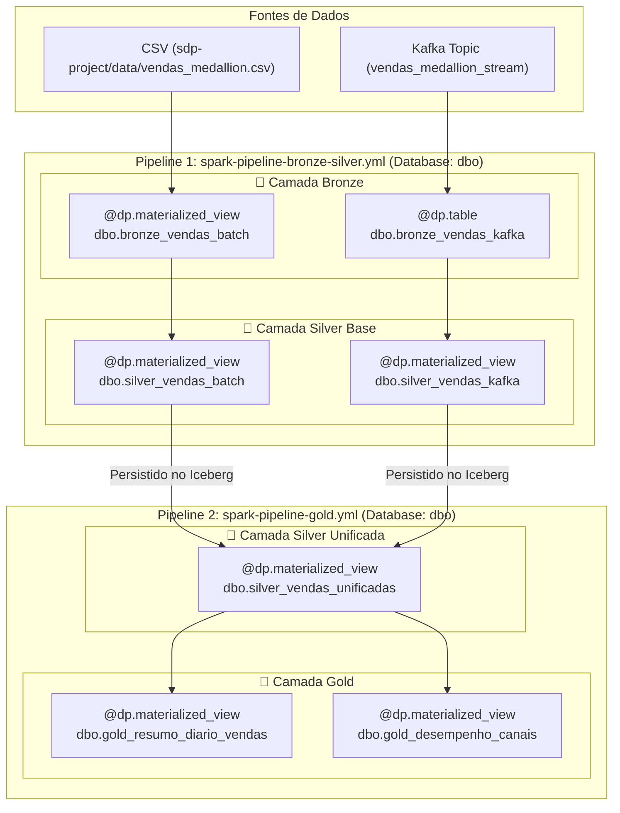

# 🚀 Spark Declarative Pipelines (SDP) - Databricks Lakeflow-Like Local Lakehouse

Este projeto é um **ambiente de estudos didático e prático** desenvolvido para testar e dominar o **Spark Declarative Pipelines (SDP)** localmente, servindo como um espelho open-source para a experiência do **Databricks Lakeflow Pipelines** (antigo *Delta Live Tables - DLT*) sem depender de custos de nuvem ou assinaturas.

A proposta é construir manual e didaticamente toda a infraestrutura de um Data Lakehouse local com **Apache Spark 4.1.3**, **Apache Kafka**, **Apache Iceberg** e **JupyterLab**, aplicando a **Arquitetura Medallion (Bronze, Silver e Gold)** com processamento unificado **Batch + Streaming** em um **único database chamado `dbo`**, desacoplado em **2 especificações de pipeline (specs)** para garantir a ordem sequencial determinística de execução no catálogo.

---

## 📑 Sumário

1. [💡 O que é o Spark Declarative Pipelines (SDP)?](#-o-que-é-o-spark-declarative-pipelines-sdp)
2. [⚔️ Comparativo: Databricks Lakeflow Pipelines vs Apache Spark 4.x SDP](#️-comparativo-databricks-lakeflow-pipelines-vs-apache-spark-4x-sdp)
3. [🧩 Paradigma Declarativo vs. Imperativo](#-paradigma-declarativo-vs-imperativo)
4. [⚙️ Como o SDP Funciona Por Baixo dos Panos](#️-como-o-sdp-funciona-por-baixo-dos-panos)
5. [🔍 Validação de DAGs com `spark-pipelines dry-run`](#-validação-de-dags-com-spark-pipelines-dry-run)
6. [🏗️ Arquitetura Medallion Unificada (Database `dbo`)](#️-arquitetura-medallion-unificada-database-dbo)
7. [📓 JupyterLab Interativo no Container (Porta 8888)](#-jupyterlab-interativo-no-container-porta-8888)
8. [💡 Estratégia de Desacoplamento dos Pipelines (2 Specs em `dbo`)](#-estratégia-de-desacoplamento-dos-pipelines-2-specs-em-dbo)
9. [📡 Simulador de Streaming Kafka (IDs Aleatórios 2000-5000)](#-simulador-de-streaming-kafka-ids-aleatórios-2000-5000)
10. [🎨 Padrões de Código e Formatação Ruff](#-padrões-de-código-e-formatação-ruff)
11. [📦 Serviços do Cluster Docker](#-serviços-do-cluster-docker)
12. [🚀 Como Executar Localmente](#-como-executar-localmente)
13. [📚 Referências & Inspirações](#-referências--inspirações)

---

## 💡 O que é o Spark Declarative Pipelines (SDP)?

No desenvolvimento tradicional com Apache Spark, o engenheiro de dados precisa escrever código **imperativo**: definir ordens explícitas de execução, gerenciar clusters, controlar loops de `writeStream`, especificar caminhos manuais de checkpoints e coordenar dependências via orquestradores externos (Airflow, Prefect, etc.).

A partir do **Apache Spark 4.1.0+**, o projeto oficial open-source introduziu o módulo **`pyspark.pipelines` (SDP)**, trazendo a capacidade de criar pipelines de dados de forma **declarativa**.

Com o SDP, você apenas declara a **intenção da transformação** (o *o quê* deve ser gerado) utilizando decorators Python como `@dp.materialized_view` e `@dp.table`. O próprio motor do Spark analisa as funções, constrói automaticamente o **Grafo Acíclico Dirigido (DAG)** de dependências e gerencia o ciclo de vida, estado e checkpoints das tabelas.

---

## ⚔️ Comparativo: Databricks Lakeflow Pipelines vs Apache Spark 4.x SDP

| Recurso / Conceito | Databricks Lakeflow Pipelines (anteriormente DLT) | Apache Spark 4.x SDP (Local / Open-Source) |
| :--- | :--- | :--- |
| **Plataforma** | Databricks Lakeflow Platform | Apache Spark 4.x Open-Source |
| **Paradigma** | Declarativo via decorators | Declarativo via decorators |
| **Decorator de View Materializada** | `@dlt.table` ou `@dlt.view` | `@dp.materialized_view` |
| **Decorator de Streaming Table** | `@dlt.table` + `spark.readStream` | `@dp.table` + `spark.readStream` |
| **Conexão entre Tabelas** | `dlt.read("tabela_upstream")` | `spark.table("tabela_upstream")` |
| **Formato de Armazenamento** | Delta Lake (padrão Databricks) | Apache Iceberg ou Delta Lake (Agnóstico) |
| **CLI / Orquestração** | Databricks Asset Bundles (DABs) / Lakeflow Jobs | `spark-pipelines run --spec ...` (CLI Oficial) |
| **Validação de DAG (Pre-flight)** | Pipeline Dry Run no Databricks UI/Bundle | `spark-pipelines dry-run --spec ...` |
| **Custo de Execução** | Requer Workspace Databricks & DBU Cloud | **100% Gratuito & Local (via Docker Compose)** |

---

## 🏗️ Arquitetura Medallion Unificada (Database `dbo`)

Todas as tabelas pertencem ao database único **`dbo`** (`local.dbo`), utilizando prefixos explícitos para identificar cada camada Medallion:



---

## 📓 JupyterLab Interativo no Container (Porta 8888)

O ambiente inclui um serviço dedicado do **JupyterLab** rodando dentro da rede Docker do cluster (`jupyter`), pré-configurado com todas as dependências (`pyspark[pipelines]`, `pandas`, `matplotlib`) e sem necessidade de senhas ou tokens.

- **URL de Acesso**: [http://localhost:8888](http://localhost:8888)
- **Notebook de Exemplo**: `notebooks/playground_medallion.ipynb`

### Exemplo de Conexão no Notebook:
```python
from pyspark.sql import SparkSession
import pyspark.sql.functions as F

# Conexão automática via Spark Connect na rede Docker
spark = SparkSession.builder \
    .remote("sc://spark-connect:15002") \
    .getOrCreate()

# Consultando as tabelas Medallion no banco dbo
df_silver = spark.table("local.dbo.silver_vendas_unificadas")
df_silver.show(10)
```

---

## 💡 Estratégia de Desacoplamento dos Pipelines (2 Specs em `dbo`)

Para garantir a ordem de execução topológica no catálogo metastore e evitar conflitos de compilação em memória ao tentar unir tabelas ainda não gravadas no catálogo, o projeto segue o padrão de **desacoplamento em 2 pipelines de execução sequencial**:

```text
sdp-project/
├── spark-pipeline-bronze-silver.yml   # Spec 1: Ingestão Bronze + Sanitização Silver Base (dbo)
├── spark-pipeline-gold.yml            # Spec 2: Silver Unificada + Datamarts Gold (dbo)
├── notebooks/
│   └── playground_medallion.ipynb     # Notebook interativo para testes no JupyterLab
├── checkpoints/                       # Checkpoints de streaming e metadados
└── transformations/
    ├── bronze_silver/
    │   ├── medallion_batch.py         # bronze_vendas_batch & silver_vendas_batch
    │   └── medallion_streaming.py     # bronze_vendas_kafka & silver_vendas_kafka
    └── gold/
        └── medallion_gold.py          # silver_vendas_unificadas & tabelas gold_*
```

---

## 📡 Simulador de Streaming Kafka (IDs Aleatórios 2000-5000)

O script [stream_simulator.sh](sdp-project/stream_simulator.sh) simula um produtor contínuo de eventos de vendas para o tópico Kafka `vendas_medallion_stream`.

Para evitar que a desduplicação `dropDuplicates(["id_venda"])` descarte transações recentes, o simulador sorteia IDs dinâmicos de vendas entre **2000 e 5000** (`SEQ=$(( 2000 + (RANDOM % 3001) ))`), garantindo novos dados contínuos nas camadas Silver e Gold.

---

## 🎨 Padrões de Código e Formatação Ruff

Todos os arquivos Python em `sdp-project/transformations/` seguem padrões rigorosos de qualidade:

- **Docstrings limpas e sem acentuação gráfica** em cada função de transformação.
- **Zero comentários inline/cabeçalho (`#`)**.
- Código formatado e validado com **Ruff** (`ruff format` e `ruff check`).

---

## 📦 Serviços do Cluster Docker

| Serviço | Porta Host | Descrição |
| :--- | :--- | :--- |
| **JupyterLab** | **8888** | Interface interativa web para testes com PySpark e Matplotlib |
| **Spark Master UI** | **8080** | Dashboard visual do cluster Spark Master |
| **Spark Connect** | **15002 / 4050** | Endpoint gRPC para conexão remota de aplicações e notebooks |
| **Spark History Server** | **18080** | Histórico detalhado de DAGs e métricas de tarefas concluídas |
| **Kafka Broker** | **9092 / 9094** | Broker de mensagens em tempo real (modo KRaft) |

---

## 🚀 Como Executar Localmente

Toda a execução do ambiente é centralizada no script de automação [run-sdp.sh](run-sdp.sh):

```bash
# 1. Garanta permissão de execução
chmod +x run-sdp.sh

# 2. Execução padrão incremental (sobe docker compose + roda pipelines):
./run-sdp.sh

# 3. Execução RÁPIDA (ignora docker compose up e roda apenas os pipelines):
./run-sdp.sh --skip-docker    # ou ./run-sdp.sh -p

# 4. Executar limpando todos os dados, checkpoints e warehouse antes de rodar:
./run-sdp.sh --clean          # ou ./run-sdp.sh -c

# 5. Executar com simulação contínua do Kafka em segundo plano:
./run-sdp.sh --simulate       # ou ./run-sdp.sh -s

# 6. Executar RÁPIDO (sem Docker) + Simulação Kafka:
./run-sdp.sh -p -s

# 7. Limpar o ambiente completo e parar os containers sem rodar nada:
./run-sdp.sh --clean-only
```
