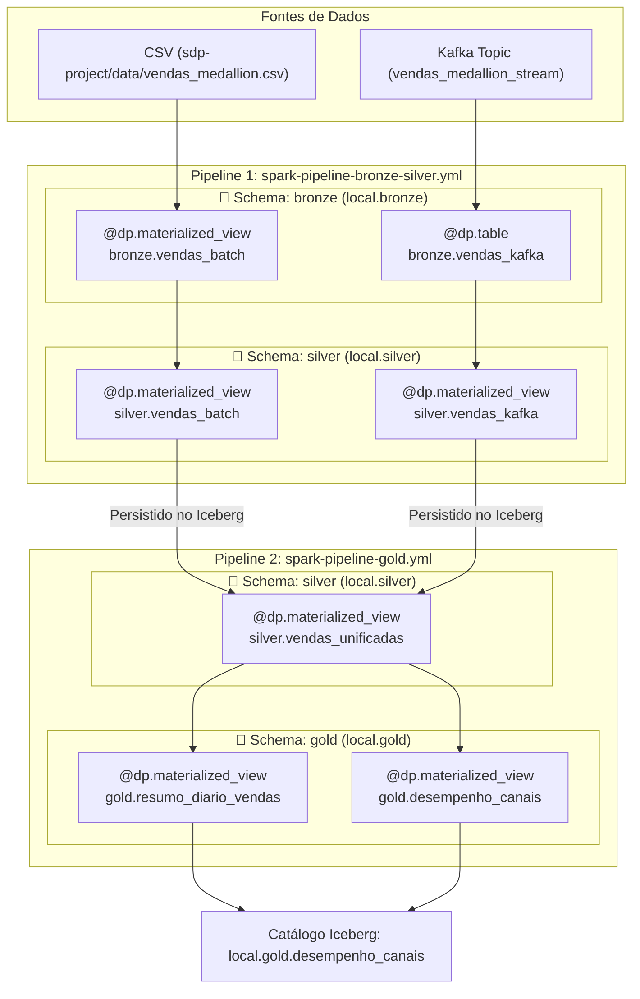

# Estudos SDP - Spark Declarative Pipelines 🚀

Este é um projeto educacional dedicado ao estudo e implementação de **Spark Declarative Pipelines (SDP)** utilizando o **Apache Spark 4.1.3**, **Apache Kafka** e o catálogo **Apache Iceberg**, estruturado sob a **Arquitetura Medallion (Bronze, Silver e Gold)** com **Execução de Pipelines Desacoplados**.

---

## 💡 Estratégia de Desacoplamento de Pipelines (Solução de Orquestração)

Para garantir a correta resolução de dependências no Spark Connect sem conflitos de compilação em tempo de inicialização do DAG, o processamento foi desacoplado em **duas especificações de pipeline (`specs`)**:

```text
sdp-project/
├── spark-pipeline-bronze-silver.yml   # Spec 1: Processa as Camadas Bronze e Silver
├── spark-pipeline-gold.yml            # Spec 2: Processa a Camada Gold consumindo das tabelas persitidas na Silver
└── transformations/
    ├── bronze_silver/
    │   ├── medallion_batch.py         # Ingestão CSV (bronze.vendas_batch -> silver.vendas_batch)
    │   └── medallion_streaming.py     # Ingestão Kafka (bronze.vendas_kafka -> silver.vendas_kafka)
    └── gold/
        └── medallion_gold.py          # Unificação (silver.vendas_unificadas -> gold.resumo_diario_vendas & gold.desempenho_canais)
```

### ⚙️ Como Funciona o Fluxo de Execução em 2 Etapas:

1. **Etapa 1 (`spark-pipeline-bronze-silver.yml`)**:
   - Executa a ingestão bruta das fontes Batch e Streaming (camada **Bronze**).
   - Aplica filtros de Data Quality, parsing JSON e sanitização (camada **Silver**).
   - Persiste fisicamente as tabelas `local.bronze.*` e `local.silver.*` no Apache Iceberg.

2. **Etapa 2 (`spark-pipeline-gold.yml`)**:
   - Executada em seguida. Como as tabelas `local.silver.vendas_batch` e `local.silver.vendas_kafka` já estão persistidas no Iceberg, a camada **Gold** lê com sucesso as tabelas upstream.
   - Gera as visões unificadas (`silver.vendas_unificadas`) e os datamarts analíticos de negócio (`gold.resumo_diario_vendas` e `gold.desempenho_canais`).

---

## 🏗️ Schemas & Arquitetura Medallion no SDP



---

## 📦 Serviços do Cluster (`spark-cluster/`)

| Container | Função | UI Web / Portas |
| :--- | :--- | :--- |
| **`spark-master`** | Coordenador do cluster | `http://localhost:8080` (Master UI)<br>`7077` (RPC Cluster), `4040` (Job UI) |
| **`spark-connect`** | Servidor Spark Connect (roda o `spark-pipelines run`) | `http://localhost:4050` (Connect UI)<br>`15002` (gRPC Connect) |
| **`spark-worker-1`** | Nó de execução Worker 1 (2 CPU, 4GB RAM) | `http://localhost:8081` |
| **`spark-worker-2`** | Nó de execução Worker 2 (2 CPU, 4GB RAM) | `http://localhost:8082` |
| **`spark-history`** | Servidor de histórico de jobs do Spark | `http://localhost:18080` (History UI) |
| **`kafka`** | Broker de mensageria Apache Kafka (KRaft) | `kafka:9092` (Interno)<br>`localhost:9094` (Externo) |

---

## 🚀 Como Executar

Toda a execução das 2 etapas do pipeline Medallion é automatizada pelo script `./run-sdp.sh`:

```bash
# 1. Garanta permissão de execução
chmod +x run-sdp.sh

# 2. Execute a automação das 2 etapas
./run-sdp.sh
```

### Sequência executada pelo `run-sdp.sh`:
```bash
# Execução da Spec 1 (Bronze + Silver Ingestion/Cleaning)
docker exec spark-connect bash -c "cd /opt/spark/sdp-project && spark-pipelines run --spec spark-pipeline-bronze-silver.yml"

# Execução da Spec 2 (Gold Datamarts & Business Aggregations)
docker exec spark-connect bash -c "cd /opt/spark/sdp-project && spark-pipelines run --spec spark-pipeline-gold.yml"
```

---

## 📚 Referências & Inspirações

- **[lakehouse-at-home / scripts / demos](https://github.com/lisancao/lakehouse-at-home/tree/master/scripts/demos)**: Repositório de referência para demonstrações práticas de Data Lakehouse local com Apache Spark e Apache Iceberg.
- **[Spark Declarative Pipelines Programming Guide](https://spark.apache.org/docs/4.1.3/declarative-pipelines-programming-guide.html)**: Guia oficial de programação do Spark 4.1.3 SDP.

---

## 🗺️ Roadmap de Estudos

- [x] Dockerfile manual com Java 21, Spark 4.1.3, Apache Iceberg 1.11.0 e Conector Kafka.
- [x] Docker Compose com Master, 2x Workers, Connect, History Server e Kafka Broker.
- [x] Schemas/Namespaces dedicados no Iceberg (`bronze`, `silver`, `gold`).
- [x] Arquitetura Medallion desacoplada em 2 pipelines (`bronze-silver` e `gold`).
- [x] Unificação de fontes Batch (CSV) e Streaming (Kafka) na Camada Silver.
- [x] Geração de Datamarts Analíticos com Views Materializadas na Camada Gold.
- [x] Automação completa das 2 etapas via [run-sdp.sh](file:///home/holanda777/projetos/estudos-sdp/run-sdp.sh).
- [ ] Testes de evolução de schema e Time Travel no Apache Iceberg.

---
*Projeto desenvolvido para fins didáticos e de exploração prática das novas capacidades declarativas do Apache Spark 4.x.*
